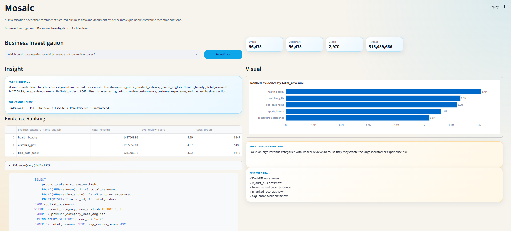
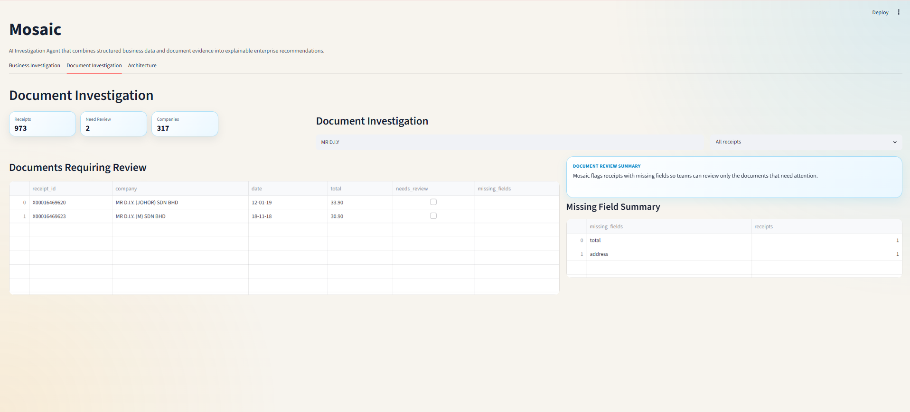

# Mosaic

> **Prototype AI Investigation Agent for Business & Document Evidence**

Mosaic started as a document intelligence platform. It has now evolved into an investigation workflow that combines business analytics and document review in one application.

## Why

Enterprise investigations are rarely based on a single data source.

Business metrics live in databases, while supporting evidence lives inside documents. Switching between dashboards, SQL tools, and documents slows investigations and makes decisions harder to verify.

Mosaic explores how these workflows can be brought together in a transparent AI-assisted experience.

---

## Current Capabilities

### 📊 Business Investigation

- Natural-language business questions
- Verified SQL generation
- DuckDB execution
- Evidence ranking
- Business recommendations

**Proof**



---

### 📄 Document Investigation

- Receipt search
- Missing-field detection
- Review queue
- Human review workflow

**Proof**



---

## Tech Stack

Python • Streamlit • DuckDB • Pandas • Plotly • FAISS • Sentence Transformers

Datasets: **Olist** • **SROIE**

---

## Status

✅ Working prototype

Current focus:

- Transparent investigations
- SQL-backed evidence
- Human-in-the-loop review
- Explainable recommendations

---

## Run

```bash
pip install -r requirements.txt

python src/olist_loader.py
python src/sroie_loader.py

streamlit run src/app.py